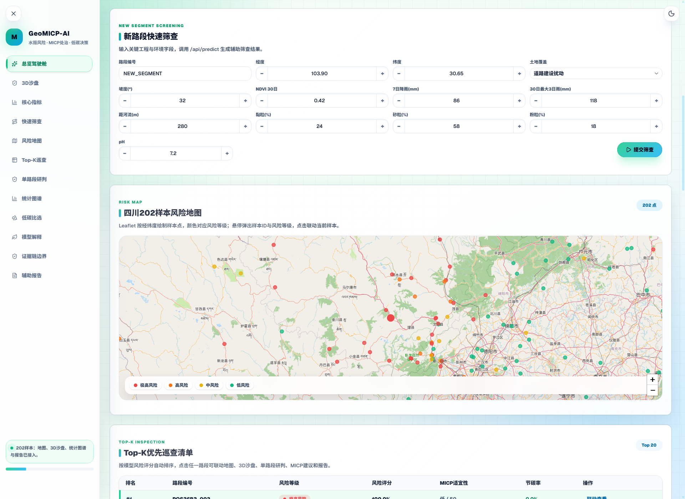
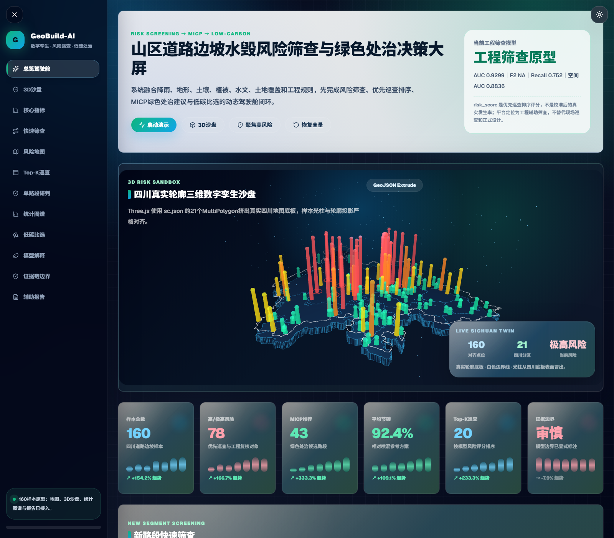
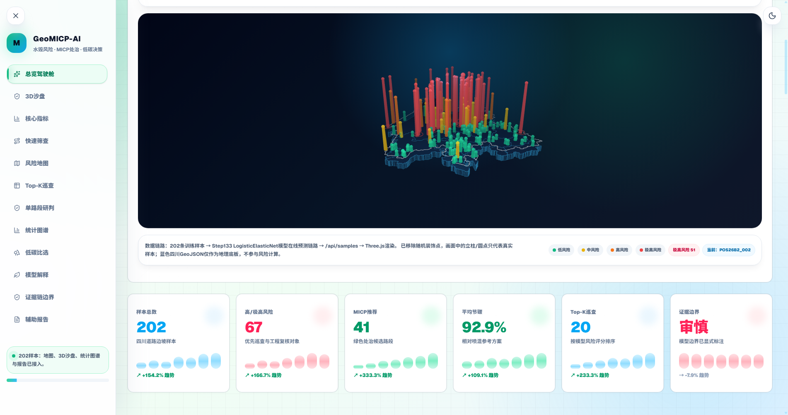

# GeoMICP-AI

GeoMICP-AI is a public, desensitized demo of a slope flood-damage risk map and MICP low-carbon decision dashboard.

It was built from my China Graduate Intelligent Construction Innovation Competition project and is packaged as a recruiter-friendly GitHub demo: React UI, 2D risk map, 3D sandbox, Top-K inspection list, SHAP-style feature explanation, carbon comparison, and single-segment screening.

> Public demo note: this repository does **not** include original competition data, real engineering coordinates, private logs, submission files, or formal design conclusions. The 202 map points are desensitized/synthetic demo samples used to show the engineering workflow.

## Highlights

- **Risk map dashboard**: Leaflet-based Sichuan risk map with 202 demo road-segment points.
- **Top-K inspection workflow**: risk-prioritized patrol list linked with map, diagnosis panel, and report panel.
- **MICP decision support**: suitability labels, low-carbon strategy comparison, and treatment-intensity hints.
- **Evidence-aware UI**: model metrics and boundary notes are shown as decision support, not as field-verified facts.
- **Offline demo fallback**: the app can run without a backend; `/api/*` calls fall back to built-in demo data.

## Audited project evidence used in the demo copy

- 202 audited samples: 82 positive / 120 negative.
- Spatial / OOF AUC from the audited project summary: about **0.86–0.91**.
- Top-20% risk-priority list hits **41 / 82** positive samples.
- React reconstruction stage: risk map, 3D sandbox, KPI cards, screening form, SHAP panel, carbon panel, report panel.

These numbers are included to document the original project evidence behind the demo. The coordinates and dashboard data in this public repo are desensitized/synthetic.

## Screenshots

### Risk map + screening panel



### Final dashboard polish



### 3D sandbox view



## Tech stack

- React 19 + TypeScript + Vite
- Leaflet for 2D map interaction
- Three.js for 3D sandbox rendering
- ECharts for statistical panels
- Framer Motion for interaction polish
- Tailwind CSS / shadcn-style UI components

## Quick start

```bash
git clone https://github.com/124-creator/GeoMICP-AI.git
cd GeoMICP-AI
npm ci
npm run dev
```

Build:

```bash
npm run build
```

## Optional backend mode

By default, the public demo uses built-in fallback data when API calls fail. If you want to connect your own backend, expose these endpoints and set `VITE_API_BASE_URL` if needed:

- `GET /api/summary`
- `GET /api/samples`
- `GET /api/carbon-schemes`
- `GET /api/shap-top-features`
- `GET /api/report/:sample_id`
- `POST /api/predict`

## Repository boundary

This repo is for portfolio demonstration and UI/workflow review only. It should not be used for real engineering design, slope treatment decisions, or emergency response without field investigation, geotechnical review, and domain-expert validation.

## Related portfolio projects

- [ResearchLoop](https://github.com/124-creator/ResearchLoop) — multi-agent research and engineering workflow.
- [ScholarLoop](https://github.com/124-creator/ScholarLoop) — trusted academic paper search and evidence-chain ranking agent.

## License

MIT.

